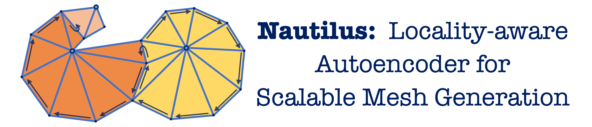

<p align="center">
  
  
  <h2 align="center"><strong>Nautilus: Locality-aware Autoencoder for Scalable Mesh Generation</strong></h2>

  <p align="center">
    <a href='yuxuanw.me'>Yuxuan Wang</a><sup>*1</sup>,</span>
    <a href='https://yxymessi.github.io'>Xuanyu Yi</a><sup>*1</sup>,</span>
    <a href='https://whaohan.github.io'>Haohan Weng</a><sup>*2</sup>,</span>
    <a href='https://ghixu.github.io'>Qingshan Xu</a><sup>1</sup>,</span>
    Xiaokang Wei<sup>3</sup>,</span>
    <br>
    <a href='https://xianghui-yang.netlify.app'>Xianghui Yang</a><sup>2</sup>,</span>
    Chunchao Guo<sup>2</sup>,</span>
    <a href='https://zjuchenlong.github.io'>Long Chen</a><sup>4</sup>,</span>
    <a href='https://mreallab.github.io/index.html'>Hanwang Zhang</a><sup>1</sup>
    <br>
    <sup>*</sup><em>Equal contribution</em>
    <br>
    <sup>1</sup>Nanyang Technological University,
    <sup>2</sup>Tencent Hunyuan,
    <br>
    <sup>3</sup>The Hong Kong Polytechnic University,
    <sup>4</sup>Hong Kong University of Science and Technology,

</p>

<div align="center">

<a href='https://nautilusmeshgen.github.io'></a> 
<a href='https://arxiv.org/abs/2501.14317'></a> 

</div>

<!-- # Nautilus: Locality-aware Autoencoder for Scalable Mesh Generation

<a href='https://nautilusmeshgen.github.io'></a> 
<a href='https://arxiv.org/abs/2501.14317'></a>  -->
   

<!-- ### [Project Page](https://nautilusmeshgen.github.io) | [Paper](https://arxiv.org/abs/2501.14317) -->

<!-- Yuxuan Wang*, Xuanyu Yi*, Haohan Weng*, Qingshan Xu, Xiaokang Wei, 

Xianghui Yang, Chunchao Guo, Long Chen, Hanwang Zhang

(_*Equal Contribution_)

Nanyang Technological University, Tencent Hunyuan, 

The Hong Kong Polytechnic University, Hong Kong University of Science and Technology -->


## Preparation

### Trained Model

Due to company confidentiality policies,
we are unable to release the model trained on the full dataset with the 1024-dimension Michelangelo encoder.

### Installation

Install the packages in `requirements.txt`. The code is tested under CUDA version 11.8.

```bash
# clone the repository
git clone https://github.com/Yuxuan-W/nautilus.git
cd nautilus
# create a new conda environment
conda create -n nautilus python=3.9 -y
conda activate nautilus
# install pytorch, we use cuda 11.8
conda install pytorch==2.4.0 torchvision==0.19.0 torchaudio==2.4.0  pytorch-cuda=11.8 -c pytorch -c nvidia -y
# install other dependencies
pip install -r requirements.txt
# install torch-scatter and torch-cluster based on your cuda version
pip install torch-scatter torch-cluster -f https://data.pyg.org/whl/torch-2.4.0+cu118.html
```

## Inference

The generation inference will be available upon the release of our checkpoints.
Generating a 5000-face mesh asset typically takes around 3 to 4 minutes on a single A100 GPU.

```bash
bash infer.sh /your/path/to/checkpoint /your/path/to/pointcloud
```

## Citation

If you find our work helps, please cite our paper:
```
@article{wang2025nautilus,
  title={Nautilus: Locality-aware Autoencoder for Scalable Mesh Generation},
  author={Wang, Yuxuan and Yi, Xuanyu and Weng, Haohan and Xu, Qingshan and Wei, Xiaokang and Yang, Xianghui and Guo, Chunchao and Chen, Long and Zhang, Hanwang},
  journal={arXiv preprint arXiv:2501.14317},
  year={2025}
}
```

<br/>

## Acknowledgement
Our code is based on the wonderful repo of [meshgpt-pytorch](https://github.com/lucidrains/meshgpt-pytorch). 
We thank the authors for their great work.

